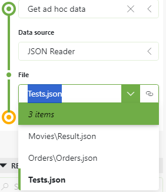

# GQI - JSON reader

GQI data source that can read in JSON files. Using this data source, you can create different data sets based on JSON files instead of creating new ad hoc data sources for every data source. This is mostly interesting for static data source.

## File structure

All JSON files are scanned within the `C:\Skyline DataMiner\Documents\GQI data sources` and are presented as data sources in the GQI data source.

Consider the following file structure.

* GQI data sources
  * Movies
    * Movies.json
  * Orders
    * Orders.json
  * Tests.json

This results in the following options in the query builder:



## Structure

The JSON file consists of three properties:

* Version
* Columns
* Rows

### Version

An integer indicating the version of the JSON file. This is property is there for if we would ever do breaking changes to the structure of the JSON file. Currently the version should be set to `1`.

### Columns

An array containing the columns of the data set. A column consists of 2 properties:

* Name
* Type

The name is a string and contains the display name of the column.
The type is a string that identifies the content type of that column.

Currently the following types are available:

* string
* int
* datetime
* double

### Rows

An array containing the rows of the data set. Every row contains of an array of cells.

Every cell consists of 2 properties.

* Value
* DisplayValue

The value can be a string or number.
The display value is a string representation of the value.

## Example

```json
{
    "Version": 1,
    "Columns": [
        {
            "Name": "Order ID",
            "Type": "string"
        },
        {
            "Name": "Created",
            "Type": "datetime"
        },
        {
            "Name": "Customer",
            "Type": "string"
        },
        {
            "Name": "Profit",
            "Type": "Double"
        }
    ],
    "Rows": [
        {
            "Cells": [
                {
                    "Value": 149384
                },
                {
                    "DisplayValue": "Nov 3, 2023",
                    "Value": 1699009200000
                },
                {
                    "Value": "Sebastiaan Dumoulein"
                },
                {
                    "DisplayValue": "$604.50",
                    "Value": 604.50
                }
            ]
        },
        {
            "Cells": [
                {
                    "Value": 153322
                },
                {
                    "DisplayValue": "Oct 28, 2023",
                    "Value": 1698487200000
                },
                {
                    "Value": "Abbas Melendez"
                },
                {
                    "DisplayValue": "$307.70",
                    "Value": 307.70
                }
            ]
        }
    ]
}
